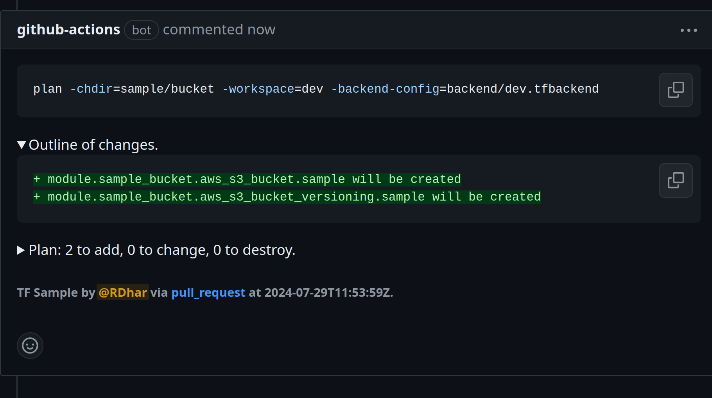

[](https://github.com/devsectop/tf-via-pr-comments/releases)
[](LICENSE)
[](https://github.com/devsectop/tf-via-pr-comments/actions/workflows/github-code-scanning/codeql)
[](https://github.com/devsectop/tf-via-pr-comments/stargazers)

[](https://github.com/opentofu/setup-opentofu)
[](https://github.com/hashicorp/setup-terraform)
[](https://github.com/marketplace/actions/terraform-opentofu-via-pr-comments)

# OpenTofu/Terraform via PR Comments

> [!IMPORTANT]
>
> GitHub Action to automate OpenTofu or Terraform (TF) CLI commands via pull request (PR) comments.
>
> Overview: [Highlights](#highlights) · [Usage](#usage) · [Security](#security) · [Changelog](#changelog) · [License](#license)

<figure>
  <picture>
    <source media="(prefers-color-scheme: dark)" srcset="assets/screenshot_dark.png">
    <source media="(prefers-color-scheme: light)" srcset="assets/screenshot_light.png">
    
  </picture>
  <figcaption>
    </br><a href="https://github.com/devsectop/tf-via-pr-comments/pull/166" title="View the PR conversation referenced in the screenshot.">View PR:</a> Screenshot of TF CLI command in a PR comment followed by github-action bot's TF output response in the next comment.
  </figcaption>
</figure>

## Highlights

### What does it do?

<details><summary>Add PR comments in the form of CLI commands to trigger OpenTofu or Terraform operations.</summary>

- Both [Hashicorp][terraform_io] `terraform` and [OpenTofu][opentofu_org] `tofu` CLIs are supported, with the latter offering an open-source and backwards-compatible drop-in replacement for the former.
- Comments beginning with `-tf=` are parsed with each argument and flag being passed into the appropriate TF command automatically.
</details>

<details><summary>Run TF CLI commands dynamically on PR open, update and close without manual intervention.</summary>

- Automate TF plan and apply as part of GitOps framework to deliver consistent infrastructure-as-code (IaC) across environments.
- Run multiple TF commands in a matrix strategy for parallel provisioning of resources across different workspaces or directories.
</details>

<details><summary>Speed up workflow by caching TF module plugins and substituting input variables.</summary>

- Use ".terraform.lock.hcl" file ([which should be included in version control](https://developer.hashicorp.com/terraform/language/files/dependency-lock#:~:text=include%20this%20file%20in%20your%20version%20control)) to cache TF plugins and associated dependencies for faster subsequent workflow runs.
- A number of input parameters can be substituted in the parsed command, such as: workspace, var-file and backend-config pre/suffixes.
</details>

### Who is it for?

<details><summary>Best suited for DevOps and Platform engineers who want to empower their teams to self-service TF without the overhead of self-hosting runners, containers or VMs like <a href="https://www.runatlantis.io" title="Atlantis Terraform PR automation.">Atlantis</a>.</summary>

- [Environment deployment protection rules][deployment_protection] mitigate the risk of erroneous changes along with standardized approval requirements.
- Each PR and associated workflow run holds a complete log of infrastructure changes for ease of collaborative debugging as well as audit compliance.
</details>

## Usage

### How does it work?

Functional workflow examples are provided below, along with associated permissions and triggers. The full list of inputs is documented [below](#inputs).

- [TF via PR Comments](.github/examples/tf_via_pr_comments.yml)
- [TF via PR Comments or Input](.github/examples/tf_via_pr_comments_or_input.yml)
- [TF via PR Input with AWS Authentication](.github/examples/tf_via_pr_input.yml)
- [TF via PR Input with Matrix Strategy](.github/examples/tf_via_pr_input_matrix.yml)
- [TF via PR Input with `tenv` Proxy](.github/workflows/tf_tests.yml)

> [!NOTE]
>
> - Pin your workflow version to a specific release tag or SHA to harden your CI/CD pipeline [security](#security) against supply chain attacks.
> - Environment variables are automatically assumed, enabling cloud provider authentication (e.g., preceding [aws-actions/configure-aws-credentials][configure_aws_credentials] action can be used to pass short-lived credentials).

### Where to use it?

Use-case: Provision resources in a workspace with a variable file, followed by targeted destruction. [View PR][pr_example_1].

```bash
#1 PR Comment: Plan configuration in a workspace with a variable file.
-tf=plan -chdir=stacks/sample_instance -workspace=dev -var-file=env/dev.tfvars

#2 PR Comment: Apply configuration in a workspace with a variable file.
-tf=apply -chdir=stacks/sample_instance -workspace=dev -var-file=env/dev.tfvars

#3 PR Comment: Plan destruction of targeted resources in a workspace with a variable file.
-tf=plan -destroy -target=aws_instance.sample,data.aws_ami.ubuntu -chdir=stacks/sample_instance -workspace=dev -var-file=env/dev.tfvars

#4 PR Comment: Apply destruction of targeted resources in a workspace with a variable file.
-tf=apply -destroy -target=aws_instance.sample,data.aws_ami.ubuntu -chdir=stacks/sample_instance -workspace=dev -var-file=env/dev.tfvars
```

Use-case: Provision resources with a backend, followed by destruction without confirmation, simultaneously. [View PR][pr_example_2].

```bash
#1 PR Comment: Plan configuration with a backend file.
-tf=plan -chdir=stacks/sample_bucket -backend-config=backend/dev.tfbackend

#2 PR Comment: Apply configuration with a backend file.
-tf=apply -chdir=stacks/sample_bucket -backend-config=backend/dev.tfbackend

#3 PR Comment: Destroy configuration with a backend file without confirmation.
-tf=apply -destroy -auto-approve -chdir=stacks/sample_bucket -backend-config=backend/dev.tfbackend
```

### Parameters

#### Inputs

| Name                                                 | Description                                                                                                                              |
| ---------------------------------------------------- | ---------------------------------------------------------------------------------------------------------------------------------------- |
| `apply_require_approval`</br>Default: false          | Boolean flag to require PR review approval for TF apply commands or consider [deployment protection rules][deployment_protection].       |
| `backend_config_from_workspace`</br>Default: false   | Boolean flag to re-use TF `-workspace` as `-backend-config` argument, if supplied.                                                       |
| `backend_config_prefix`</br>Example: ../backend/     | String prefix for TF `-backend-config` argument, if `-backend-config` (or `-workspace` and `backend_config_from_workspace`) is supplied. |
| `backend_config_suffix`</br>Example: .tfbackend      | String suffix for TF `-backend-config` argument, if `-backend-config` (or `-workspace` and `backend_config_from_workspace`) is supplied. |
| `cache_plugins`</br>Default: true                    | Boolean flag to cache TF plugins for faster workflow runs (requires .terraform.lock.hcl file).                                           |
| `chdir_prefix`</br>Example: stacks/                  | String prefix for TF `-chdir` argument. This is a global argument that switches to a different directory.                                |
| `cli_uses`</br>Example: tofu                         | String name of TF CLI to use and override default assumption from wrapper environment variable.                                          |
| `command_input`</br>Example: -tf=plan -workspace=dev | String input to run TF CLI command with arguments directly via workflow automation.                                                      |
| `fmt_enable`</br>Default: true                       | Boolean flag to enable TF fmt command and display diff of changes.                                                                       |
| `recreate_comment`</br>Default: true                 | Boolean flag to recreate PR comment on update instead of editing the existing one.                                                       |
| `validate_enable`</br>Default: false                 | Boolean flag to enable TF validate command check.                                                                                        |
| `var_file_from_workspace`</br>Default: false         | Boolean flag to re-use TF `-workspace` as `-var-file` argument, if supplied.                                                             |
| `var_file_prefix`</br>Example: ../env/               | String prefix for TF `-var-file` argument, if `-var-file` (or `-workspace` and `var_file_from_workspace`) is supplied.                   |
| `var_file_suffix`</br>Example: .tfvars               | String suffix for TF `-var-file` argument, if `-var-file` (or `-workspace` and `var_file_from_workspace`) is supplied.                   |

#### Outputs

| Name                                                          | Description                                                     |
| ------------------------------------------------------------- | --------------------------------------------------------------- |
| `command`</br>Example: `{tf:plan,chdir:stacks/sample_bucket}` | JSON object of the parsed command.                              |
| `comment_id`</br>Example: 1234567890                          | String ID of the PR comment created or updated by the workflow. |
| `plan_id`</br>Example: stacks-sample-bucket-tfplan            | String ID of the TF plan file artifact's unique identifier.     |
| `tf_fmt`                                                      | String output of the truncated TF fmt command.                  |
| `tf_output`                                                   | String output of the truncated last TF command.                 |

## Security

Integrating security in your CI/CD pipeline is critical to practicing DevSecOps. This GHA aims to be secure by default, and it should be complemented with your own review to ensure it meets your (organization's) security requirements.

- All associated GHAs used in this workflow are [pinned to a specific SHA][securing_github_actions] to prevent supply chain attacks from third-party upstream dependencies.
- Restrict changes to certain environments with [deployment protection rules][deployment_protection] or `apply_require_approval` so that approval is required from authorized users/teams before changes to the infrastructure can be applied.
- Ease of integration with [OpenID Connect][configure_oidc] by passing short-lived credentials as environment variables to the workflow.

## Changelog

- All notable changes to this project will be documented in human-friendly [releases][releases].
- The format is based on [Keep a Changelog](https://keepachangelog.com), and this project adheres to [Semantic Versioning](https://semver.org).

> [!NOTE]
>
> All forms of contribution are very welcome and deeply appreciated for fostering open-source projects.
>
> - Please [create a PR][pull_request] to contribute changes you'd like to see.
> - Please [raise an issue][issue] to discuss proposed changes or report unexpected behavior.
> - Please [open a discussion][discussion] to share ideas about where you'd like to see this project go.
> - Please [consider becoming a stargazer][stargazer] if you find this project useful.
>
> Includes a [GitHub Codespaces][github_codespaces] dev container, which offers a tailored TF development environment, complete with tools and runtimes to lower the barrier to entry for contributors.

## License

- This project is licensed under the permissive [Apache License 2.0][license].
- All works herein are my own and shared of my own volition.
- Copyright 2022-2024 [Rishav Dhar][rishav_dhar] — All wrongs reserved.

[configure_aws_credentials]: https://github.com/aws-actions/configure-aws-credentials "Configuring AWS credentials for use in GitHub Actions."
[configure_oidc]: https://docs.github.com/en/actions/deployment/security-hardening-your-deployments/configuring-openid-connect-in-cloud-providers "Configuring OpenID Connect in cloud providers."
[deployment_protection]: https://docs.github.com/en/actions/deployment/targeting-different-environments/using-environments-for-deployment#deployment-protection-rules "Configuring environment deployment protection rules."
[discussion]: https://github.com/devsectop/tf-via-pr-comments/discussions "Open a discussion."
[github_codespaces]: https://docs.github.com/en/codespaces/setting-up-your-project-for-codespaces/adding-a-dev-container-configuration/introduction-to-dev-containers "Introduction to GitHub Codespaces."
[issue]: https://github.com/devsectop/tf-via-pr-comments/issues "Raise an issue."
[license]: LICENSE "Apache License 2.0."
[opentofu_org]: https://opentofu.org "Open-source Terraform-compatible IaC tool."
[pr_example_1]: https://github.com/devsectop/tf-via-pr-comments/pull/164 "Example PR for this use-case."
[pr_example_2]: https://github.com/devsectop/tf-via-pr-comments/pull/166 "Example PR for this use-case."
[pull_request]: https://github.com/devsectop/tf-via-pr-comments/pulls "Create a pull request."
[releases]: https://github.com/devsectop/tf-via-pr-comments/releases "Releases."
[rishav_dhar]: https://github.com/rdhar "Rishav Dhar's GitHub profile."
[securing_github_actions]: https://docs.github.com/en/actions/security-guides/security-hardening-for-github-actions#using-third-party-actions "Security hardening for GitHub Actions."
[semver]: https://www.npmjs.com/package/semver#ranges "Semantic versioning ranges."
[stargazer]: https://github.com/devsectop/tf-via-pr-comments/stargazers "Become a stargazer."
[terraform_io]: https://www.terraform.io "Terraform by Hashicorp."
