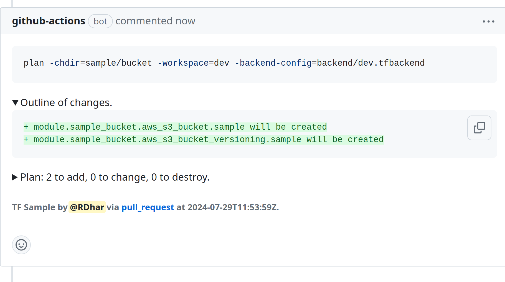

[](https://github.com/devsectop/tf-via-pr/releases)
[](LICENSE)
[](https://github.com/devsectop/tf-via-pr/actions/workflows/github-code-scanning/codeql)
[](https://github.com/devsectop/tf-via-pr/stargazers)

[](https://github.com/opentofu/setup-opentofu)
[](https://github.com/hashicorp/setup-terraform)
[](https://github.com/marketplace/actions/opentofu-terraform-via-pull-request)

# OpenTofu/Terraform via Pull Request

> [!NOTE]
>
> GitHub Action to plan and apply OpenTofu/Terraform (TF) via pull request (PR) automation.
>
> Overview: [Highlights](#highlights) · [Usage](#usage) · [Parameters](#parameters) · [Security](#security) · [Changelog](#changelog) · [License](#license)

<figure>
  <a href="assets/screenshot_light.png" target="_blank">
    <picture>
      <source media="(prefers-color-scheme: dark)" srcset="assets/screenshot_dark.png">
      <source media="(prefers-color-scheme: light)" srcset="assets/screenshot_light.png">
      
    </picture>
    <figcaption>
      </br><em>Screenshot of PR comment example with multiple command arguments.</em>
    </figcaption>
</figure>

## Highlights

### What does it do?

<details><summary>Configure OpenTofu/Terraform to run multiple commands automatically via PR trigger events.</summary>

- Both [Hashicorp][terraform_io] `terraform` and [OpenTofu][opentofu_org] `tofu` CLIs are supported, with the latter offering an open-source and backwards-compatible drop-in replacement for the former.
- Prerequisite commands like `init` are run automatically, along with user-configurable options for workspace, var-file, backend-config, and [more](#parameters).
- Multiple TF commands can be run in parallel across different workspaces, directories, or files with matrix [strategy](#usage).
</details>

</details>

<details><summary>Retrieve TF plan file for apply, cache TF module plugins, and dynamically substitute input variables.</summary>

- Store TF plan file as a repository artifact for later reference or for use in subsequent TF `apply` or `destroy` commands.
- Use ".terraform.lock.hcl" file ([which should be included in version control](https://developer.hashicorp.com/terraform/language/files/dependency-lock#:~:text=include%20this%20file%20in%20your%20version%20control)) to cache TF plugins and associated dependencies for faster subsequent workflow runs.
</details>

### Who is it for?

<details><summary>Best suited for DevOps and Platform engineers wanting to empower their teams to self-service scalably.</summary>

- Each PR and associated workflow run holds a complete log of infrastructure changes for ease of collaborative debugging as well as audit compliance.
- Removes the overhead of needing to maintain dedicated TF runners, containers or VMs like [Atlantis](https://www.runatlantis.io).
</details>

## Usage

### How to get started quickly?

```yaml
on:
  pull_request:
  push:
    branches: [main]

jobs:
  tf:
    runs-on: ubuntu-latest

    permissions:
      actions: read # Required to download repository artifact.
      checks: write # Required to add status summary.
      contents: read # Required to checkout repository.
      pull-requests: write # Required to add PR comment and label.

    steps:
      - uses: actions/checkout@v4
      - uses: opentofu/setup-opentofu@v1
      - uses: devsectop/tf-via-pr@v11
        with:
          arg_chdir: sample/directory/path
          arg_command: ${{ github.event_name == 'push' && 'apply' || 'plan' }}
          arg_lock: ${{ github.event_name == 'push' && 'true' || 'false' }}
          arg_var_file: env/dev.tfvars
          arg_workspace: development
```

> [!TIP]
>
> - Pin your workflow version to a specific release tag or SHA to harden your CI/CD pipeline [security](#security) against supply chain attacks.
> - Environment variables can be passed in for cloud provider authentication (e.g., [aws-actions/configure-aws-credentials][configure_aws_credentials] action can be used for short-lived credentials).

### Where to find more examples?

The following functional workflow examples demonstrate common use-cases, while a comprehensive list of inputs is documented [below](#parameters).

- [Trigger](.github/examples/pr_push_auth.yaml) on `pull_request` (plan) and `push` (apply) events with Terraform and AWS **authentication**.
- [Trigger](.github/examples/pr_merge_matrix.yaml) on `pull_request` (plan) and `merge_group` (apply) events with OpenTofu in **matrix** strategy.
- [Trigger](.github/examples/pr_tenv.yaml) on `pull_request` (plan or apply) event with [tenv](https://tofuutils.github.io/tenv/) to avoid TF **wrapper** on **self-hosted** runners.

### How does encryption work?

Before the workflow uploads the TF plan file as an artifact, it can be encrypted with a passphrase to prevent exposure of sensitive data using `encrypt_passphrase` input with a secret (e.g., `${{ secrets.KEY }}`). This is done with [OpenSSL](https://docs.openssl.org/master/man1/openssl-enc/)'s symmetric stream counter mode encryption with salt and pbkdf2.

In order to locally decrypt the TF plan file, use the following command (noting the whitespace prefix to prevent recording the command in shell history):

```sh
 openssl enc -aes-256-ctr -pbkdf2 -salt -in <tfplan> -out <tfplan.decrypted> -pass pass:<passphrase> -d
```

## Parameters

### Inputs - Configuration

| Name                                                   | Description                                                                                            |
| ------------------------------------------------------ | ------------------------------------------------------------------------------------------------------ |
| `cache_plugins`</br>Default: `false`                   | Boolean flag to cache TF plugins for faster workflow runs (requires .terraform.lock.hcl file).         |
| `comment_pr`</br>Default: `true`                       | Boolean flag to add PR comment of TF command output.                                                   |
| `encrypt_passphrase`</br>Example: `${{ secrets.KEY }}` | String passphrase to encrypt the TF plan file.                                                         |
| `fmt_enable`</br>Default: `true`                       | Boolean flag to enable TF fmt command and display diff of changes.                                     |
| `label_pr`</br>Default: `true`                         | Boolean flag to add PR label of TF command to run.                                                     |
| `plan_parity`</br>Default: `false`                     | Boolean flag to compare the TF plan file with a newly-generated one to prevent stale apply.            |
| `tenv_version`</br>Example: `v3.1.0`                   | String version tag of the tenv tool to install and use.                                                |
| `tf_tool`</br>Default: `terraform`                     | String name of the TF tool to use and override default assumption from wrapper environment variable.   |
| `tf_version`</br>Example: `~> 1.8.0`                   | String version constraint of the TF tool to install and use.                                           |
| `update_comment`</br>Default: `false`                  | Boolean flag to update existing PR comment instead of creating a new comment and deleting the old one. |
| `validate_enable`</br>Default: `false`                 | Boolean flag to enable TF validate command check.                                                      |

### Inputs - Arguments

| Name                              | Description                                                                                                                                     |
| --------------------------------- | ----------------------------------------------------------------------------------------------------------------------------------------------- |
| `arg_auto_approve`                | Boolean flag to toggle skipping of interactive approval of plan before applying.                                                                |
| `arg_backend`                     | Boolean flag to toggle TF backend initialization.                                                                                               |
| `arg_backend_config`              | Comma-separated string list of file path(s) to the backend configuration.                                                                       |
| `arg_backup`                      | Boolean flag to toggle backup of the existing state file before modifying.                                                                      |
| `arg_chdir`                       | String path to the working directory where the TF command should be run.                                                                        |
| `arg_check`                       | Boolean flag to toggle checking of file formatting with appropriate exit code.                                                                  |
| `arg_cloud`                       | Boolean flag to toggle TF backend initialization.                                                                                               |
| `arg_command`</br>Default: plan   | String name of the TF command to run (either 'plan' or 'apply').                                                                                |
| `arg_compact_warnings`            | Boolean flag to toggle compact output for warnings.                                                                                             |
| `arg_concise`                     | Boolean flag to toggle skipping of refresh log lines.                                                                                           |
| `arg_destroy`                     | Boolean flag to toggle destruction of all managed objects.                                                                                      |
| `arg_detailed_exitcode`           | String to set the detailed exit code mode.                                                                                                      |
| `arg_diff`</br>Default: true      | Boolean flag to toggle display diff of formatting changes.                                                                                      |
| `arg_force_copy`                  | Boolean flag to toggle suppression of prompts about copying state data.                                                                         |
| `arg_from_module`                 | String path to copy contents from the given module source into the target directory.                                                            |
| `arg_generate_config_out`         | String path to write the generated configuration.                                                                                               |
| `arg_get`                         | Boolean flag to toggle downloading of modules for the configuration.                                                                            |
| `arg_ignore_remote_version`       | Boolean flag to toggle checking if the local and remote TF versions use compatible state representations.                                       |
| `arg_json`                        | Boolean flag to toggle JSON output format.                                                                                                      |
| `arg_list`</br>Default: false     | Boolean flag to toggle listing of files whose formatting differs.                                                                               |
| `arg_lock`                        | Boolean flag to toggle state locking during state operations.                                                                                   |
| `arg_lock_timeout`                | String duration to retry a state lock.                                                                                                          |
| `arg_lockfile`                    | String to set dependency lockfile mode.                                                                                                         |
| `arg_migrate_state`               | Boolean flag to toggle reconfiguration of the backend, attempting to migrate any existing state.                                                |
| `arg_no_tests`                    | Boolean flag to toggle validation of test files.                                                                                                |
| `arg_or_create`                   | Boolean flag to toggle workspace creation if it doesn't exist.                                                                                  |
| `arg_out`</br>Default: tfplan     | String path to write the generated plan.                                                                                                        |
| `arg_parallelism`                 | String number to limit the number of concurrent operations.                                                                                     |
| `arg_plugin_dir`                  | Comma-separated string list of directory path(s) containing plugin binaries.                                                                    |
| `arg_reconfigure`                 | Boolean flag to toggle reconfiguration of the backend, ignoring any saved configuration.                                                        |
| `arg_recursive`</br>Default: true | Boolean flag to toggle recursive processing of directories.                                                                                     |
| `arg_refresh`                     | Boolean flag to skip checking of external changes to remote objects.                                                                            |
| `arg_refresh_only`                | Boolean flag to toggle checking of remote objects still match the current configuration without proposing any actions to undo external changes. |
| `arg_replace`                     | Comma-separated string list of resource addresses to replace.                                                                                   |
| `arg_state`                       | String path to read and save state.                                                                                                             |
| `arg_state_out`                   | String path to write state.                                                                                                                     |
| `arg_target`                      | Comma-separated string list of resource addresses to target.                                                                                    |
| `arg_test_directory`              | String path to the test directory.                                                                                                              |
| `arg_upgrade`                     | Boolean flag to toggle upgrading the latest module and provider versions allowed within configured constraints.                                 |
| `arg_var`                         | Comma-separated string list of variables to set in the format 'key=value'.                                                                      |
| `arg_var_file`                    | Comma-separated string list of file path(s) to the variable configuration.                                                                      |
| `arg_workspace`                   | String name of the workspace to select or create.                                                                                               |
| `arg_write`</br>Default: false    | Boolean flag to toggle writing of formatted files.                                                                                              |

### Outputs

| Name          | Description                                       |
| ------------- | ------------------------------------------------- |
| `check_id`    | String output of the workflow check run ID.       |
| `comment_id`  | String output of the PR comment ID.               |
| `exitcode`    | String output of the last TF command's exitcode. |
| `fmt_result`  | String output of the TF fmt command.              |
| `header`      | String output of the TF command input.            |
| `identifier`  | String output of the TF run's unique identifier.  |
| `last_result` | String output of the last TF command.             |
| `outline`     | String outline of the TF plan.                    |
| `summary`     | String summary of the last TF command.            |

## Security

Integrating security in your CI/CD pipeline is critical to practicing DevSecOps. This action aims to be secure by default, and it should be complemented with your own review to ensure it meets your (organization's) security requirements.

- Action dependencies are maintained by GitHub and [pinned to a specific SHA][securing_github_actions]: [actions/cache](https://github.com/actions/cache), [actions/github-script](https://github.com/actions/github-script) and [actions/upload-artifact](https://github.com/actions/upload-artifact).
- Restrict changes to certain environments with [deployment protection rules][deployment_protection] so that approval is required before changes to the infrastructure can be applied.
- Ease of integration with [OpenID Connect][configure_oidc] by passing short-lived credentials as environment variables to the workflow.

## Changelog

- All notable changes to this project are documented in human-friendly [releases][releases].
- The format is based on [Keep a Changelog](https://keepachangelog.com), and this project adheres to [Semantic Versioning](https://semver.org).

> [!TIP]
>
> All forms of contribution are very welcome and deeply appreciated for fostering open-source projects.
>
> - Please [create a PR][pull_request] to contribute changes you'd like to see.
> - Please [raise an issue][issue] to discuss proposed changes or report unexpected behavior.
> - Please [open a discussion][discussion] to share ideas about where you'd like to see this project go.
> - Please [consider becoming a stargazer][stargazer] if you find this project useful.
>
> This project includes a [GitHub Codespaces][github_codespaces] container for a tailored TF development environment, complete with tools and runtimes to lower the barrier to entry for contributors.

## License

- This project is licensed under the permissive [Apache License 2.0][license].
- All works herein are my own, shared of my own volition, and [contributors][contributors].
- Copyright 2022-2024 [Rishav Dhar][rishav_dhar] — All wrongs reserved.

[configure_aws_credentials]: https://github.com/aws-actions/configure-aws-credentials "Configuring AWS credentials for use in GitHub Actions."
[configure_oidc]: https://docs.github.com/en/actions/deployment/security-hardening-your-deployments/configuring-openid-connect-in-cloud-providers "Configuring OpenID Connect in cloud providers."
[contributors]: https://github.com/devsectop/tf-via-pr/graphs/contributors "Contributors."
[deployment_protection]: https://docs.github.com/en/actions/deployment/targeting-different-environments/using-environments-for-deployment#deployment-protection-rules "Configuring environment deployment protection rules."
[discussion]: https://github.com/devsectop/tf-via-pr/discussions "Open a discussion."
[github_codespaces]: https://docs.github.com/en/codespaces/setting-up-your-project-for-codespaces/adding-a-dev-container-configuration/introduction-to-dev-containers "Introduction to GitHub Codespaces."
[issue]: https://github.com/devsectop/tf-via-pr/issues "Raise an issue."
[license]: LICENSE "Apache License 2.0."
[opentofu_org]: https://opentofu.org "Open-source Terraform-compatible IaC tool."
[pr_example_1]: https://github.com/devsectop/tf-via-pr/pull/164 "Example PR for this use-case."
[pr_example_2]: https://github.com/devsectop/tf-via-pr/pull/166 "Example PR for this use-case."
[pull_request]: https://github.com/devsectop/tf-via-pr/pulls "Create a pull request."
[releases]: https://github.com/devsectop/tf-via-pr/releases "Releases."
[rishav_dhar]: https://github.com/rdhar "Rishav Dhar's GitHub profile."
[securing_github_actions]: https://docs.github.com/en/actions/security-guides/security-hardening-for-github-actions#using-third-party-actions "Security hardening for GitHub Actions."
[semver]: https://www.npmjs.com/package/semver#ranges "Semantic versioning ranges."
[stargazer]: https://github.com/devsectop/tf-via-pr/stargazers "Become a stargazer."
[terraform_io]: https://www.terraform.io "Terraform by Hashicorp."
