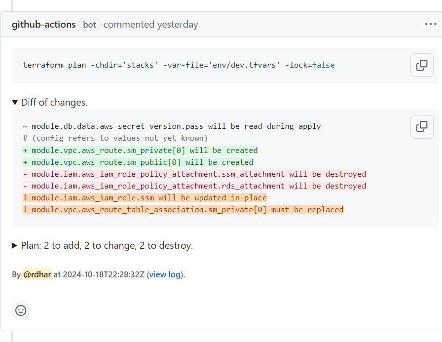
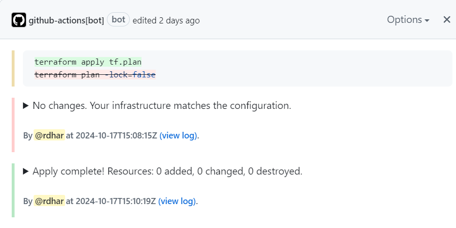

[](https://github.com/hashicorp/setup-terraform "Terraform Compatible.")
[](https://github.com/opentofu/setup-opentofu "OpenTofu Compatible.")
*
[](../LICENSE.txt "Apache License 2.0.")
[](https://github.com/devsectop/tf-via-pr/releases "View all releases.")
*
[](https://github.com/devsectop/tf-via-pr "Become a stargazer.")

# Terraform/OpenTofu via Pull Request (TF-via-PR)

<details open><summary><h3>Overview: <a href="#usage">Usage Examples</a> · <a href="#parameters">In/Output Parameters</a> · <a href="#security">Security</a> · <a href="#changelog">Changelog</a> · <a href="#license">License</a></h3></summary></br>

[](https://github.com/devsectop/tf-via-pr/blob/main/docs/assets/comment.png?raw=true "View full-size image.")
</details>

<table>
  <tr>
    <th>
      <h3>What does it do?</h3>
    </th>
    <th>
      <h3>Who is it for?</h3>
    </th>
  </tr>
  <tr>
    <td>
      <ul>
        <li>Plan and apply changes with CLI arguments and encrypted plan file to avoid configuration drift.</li>
        <li>Outline diff changes within updated PR comment and matrix-friendly workflow summary, complete with log.</li>
      </ul>
    </td>
    <td>
      <ul>
        <li>DevOps and Platform engineers wanting to empower their teams to self-service scalably.</li>
        <li>Maintainers looking to secure their pipeline without the overhead of containers or VMs.</li>
      </ul>
    </td>
  </tr>
</table>
</br>

## Usage

### How to get started quickly?

```yaml
on:
  pull_request:
  push:
    branches: [main]

jobs:
  provision:
    runs-on: ubuntu-latest

    permissions:
      actions: read        # Required to identify workflow run.
      checks: write        # Required to add status summary.
      contents: read       # Required to checkout repository.
      pull-requests: write # Required to add comment and label.

    steps:
      - uses: actions/checkout@4
      - uses: hashicorp/setup-terraform@v3
      - uses: devsectop/tf-via-pr@v12
        with:
          # Only plan by default, or apply with lock on merge.
          command: ${{ github.event_name == 'push' && 'apply' || 'plan' }}
          arg-lock: ${{ github.event_name == 'push' }}
          arg-var-file: env/dev.tfvars
          arg_workspace: dev-use1
          working-directory: path/to/directory
          plan-encrypt: ${{ secrets.PASSPHRASE }}
```

> [!TIP]
>
> - Pin your workflow version to a specific release tag or SHA to harden your CI/CD pipeline [security](#security) against supply chain attacks.
> - Environment variables can be passed in for cloud platform authentication (e.g., [configure-aws-credentials](https://github.com/aws-actions/configure-aws-credentials "Configuring AWS credentials for use in GitHub Actions.") for short-lived credentials).

### Where to find more examples?

The following workflows showcase common use cases, while a comprehensive list of inputs is [documented](#parameters) below.

<table>
  <tr>
    <td>
      <a href="/.github/examples/pr_push_auth.yaml">Run on</a> <code>pull_request</code> (plan) and <code>push</code> (apply) events with Terraform and AWS <strong>authentication</strong>.
    </td>
    <td>
      <a href="/.github/examples/pr_merge_matrix.yaml">Run on</a> <code>pull_request</code> (plan) and <code>merge_group</code> (apply) events with OpenTofu in <strong>matrix</strong> strategy.
    </td>
  </tr>
  <tr>
    <td>
      <a href="/.github/examples/pr_self_hosted.yaml">Run on</a> <code>pull_request</code> (plan or apply) event with Terraform and OpenTofu on <strong>self-hosted</strong> runner.
    </td>
    <td>
      <a href="/.github/examples/schedule_refresh.yaml">Run on</a> <code>schedule</code> (cron) event with "fmt" and "validate" checks to identify <strong>configuration drift</strong>.
    </td>
  </tr>
</table>

### How does encryption work?

Before the workflow uploads the plan file as an artifact, it can be encrypted with a passphrase to prevent exposure of sensitive data using `plan-encrypt` input with a secret (e.g., `${{ secrets.PASSPHRASE }}`). This is done with [OpenSSL](https://docs.openssl.org/master/man1/openssl-enc/ "OpenSSL encryption documentation.")'s symmetric stream counter mode encryption with salt and pbkdf2.

In order to decrypt the plan file locally, use the following commands after downloading the artifact (noting the whitespace before `openssl` to prevent recording the command in shell history):

```fish
unzip <tf.plan>
 openssl enc -aes-256-ctr -pbkdf2 -salt -in <tf.plan> -out tf.plan.decrypted -pass pass:"<passphrase>" -d
<tf.tool> show tf.plan.decrypted
```
</br>

## Parameters

### Inputs - Configuration

| Type     | Name                | Description                                                                                                    |
| -------- | ------------------- | -------------------------------------------------------------------------------------------------------------- |
| CLI      | `command`           | Command to run between: `plan` or `apply`.</br>Default: `plan`                                                 |
| CLI      | `working-directory` | Specify the working directory of TF code, alias of `arg-chdir`.</br>Example: `path/to/directory`               |
| CLI      | `tool`              | Choose the tool to provision TF code.</br>Default: `terraform`                                                 |
| Check    | `format`            | Check format of TF code.</br>Default: `false`                                                                  |
| Check    | `validate`          | Check validation of TF code.</br>Default: `false`                                                              |
| Check    | `plan-parity`       | Compare the plan file with a newly-generated one to prevent stale apply.</br>Default: `false`                  |
| Security | `plan-encrypt`      | Encrypt plan file artifact with the given input.</br>Example: `${{ secrets.PASSPHRASE }}`                      |
| Security | `token`             | Specify a GitHub token.</br>Default: `${{ github.token }}`                                                     |
| UI       | `comment-pr`        | PR comment by: `update` existing comment, `recreate` and delete previous one, or `none`.</br>Default: `update` |
| UI       | `label-pr`          | Add a PR label with the command input.</br>Default: `true`                                                     |
| UI       | `hide-args`         | Hide comma-separated arguments from the command input.</br>Default: `detailed-exitcode,lock,out,var`           |

<details open><summary>The default behavior of <code>comment-pr</code> is to update the existing PR comment with the latest plan output, making it easy to track changes over time through the comment's revision history.</summary></br>

[](https://github.com/devsectop/tf-via-pr/blob/main/docs/assets/revisions.png?raw=true "View full-size image.")
</details>

### Inputs - Arguments

> [!NOTE]
>
> - Arguments are passed to the appropriate TF command(s) automatically, whether that's `init`, `workspace`, `validate`, `plan`, or `apply`.</br>
> - For repeated arguments like `arg-var`, `arg-replace` and `arg-target`, use commas to separate multiple values (e.g., `arg-var: key1=value1,key2=value2`).

<details><summary>Toggle view of all available arguments.</summary>

| Name                      | Description                              |
| ------------------------- | ---------------------------------------- |
| `arg-auto-approve`        | `-auto-approve`                          |
| `arg-backend-config`      | `-backend-config`                        |
| `arg-backend`             | `-backend`                               |
| `arg-backup`              | `-backup`                                |
| `arg-chdir`               | `-chdir`                                 |
| `arg-check`               | `-check`</br>Default: `true`             |
| `arg-compact-warnings`    | `-compact-warnings`                      |
| `arg-concise`             | `-concise`                               |
| `arg-destroy`             | `-destroy`                               |
| `arg-detailed-exitcode`   | `-detailed-exitcode`</br>Default: `true` |
| `arg-diff`                | `-diff`</br>Default: `true`              |
| `arg-force-copy`          | `-force-copy`                            |
| `arg-from-module`         | `-from-module`                           |
| `arg-generate-config-out` | `-generate-config-out`                   |
| `arg-get`                 | `-get`                                   |
| `arg-list`                | `-list`                                  |
| `arg-lock-timeout`        | `-lock-timeout`                          |
| `arg-lock`                | `-lock`                                  |
| `arg-lockfile`            | `-lockfile`                              |
| `arg-migrate-state`       | `-migrate-state`                         |
| `arg-no-tests`            | `-no-tests`                              |
| `arg-or-create`           | `-or-create`</br>Default: `true`         |
| `arg-parallelism`         | `-parallelism`                           |
| `arg-plugin-dir`          | `-plugin-dir`                            |
| `arg-reconfigure`         | `-reconfigure`                           |
| `arg-recursive`           | `-recursive`</br>Default: `true`         |
| `arg-refresh-only`        | `-refresh-only`                          |
| `arg-refresh`             | `-refresh`                               |
| `arg-replace`             | `-replace`                               |
| `arg-state-out`           | `-state-out`                             |
| `arg-state`               | `-state`                                 |
| `arg-target`              | `-target`                                |
| `arg-test-directory`      | `-test-directory`                        |
| `arg-upgrade`             | `-upgrade`                               |
| `arg-var-file`            | `-var-file`                              |
| `arg-var`                 | `-var`                                   |
| `arg-workspace`           | `-workspace`                             |
| `arg-write`               | `-write`                                 |
</details>

### Outputs

| Name         | Description                                   |
| ------------ | --------------------------------------------- |
| `check-id`   | ID of the check run.                          |
| `comment-id` | ID of the PR comment.                         |
| `exitcode`   | Exit code of the last TF command.             |
| `identifier` | Unique name of the workflow run and artifact. |
</br>

## Security

View [security policy and reporting instructions](SECURITY.md).
</br>

## Changelog

View [all notable changes](https://github.com/devsectop/tf-via-pr/releases "Releases.") to this project in [Keep a Changelog](https://keepachangelog.com "Keep a Changelog.") format, which adheres to [Semantic Versioning](https://semver.org "Semantic Versioning.").

> [!TIP]
>
> All forms of **contribution are very welcome** and deeply appreciated for fostering open-source projects.
>
> - [Create a PR](https://github.com/devsectop/tf-via-pr/pulls "Create a pull request.") to contribute changes you'd like to see.
> - [Raise an issue](https://github.com/devsectop/tf-via-pr/issues "Raise an issue.") to propose changes or report unexpected behavior.
> - [Open a discussion](https://github.com/devsectop/tf-via-pr/discussions "Open a discussion.") to discuss broader topics or questions.
> - [Become a stargazer](https://github.com/devsectop/tf-via-pr/stargazers "Become a stargazer.") if you find this project useful.
</br>

## License

- This project is licensed under the permissive [Apache License 2.0](../LICENSE.txt "Apache License 2.0.").
- All works herein are my own, shared of my own volition, and [contributors](https://github.com/devsectop/tf-via-pr/graphs/contributors "Contributors.").
- Copyright 2022-2024 [Rishav Dhar](https://github.com/rdhar "Rishav Dhar's GitHub profile.") — All wrongs reserved.
